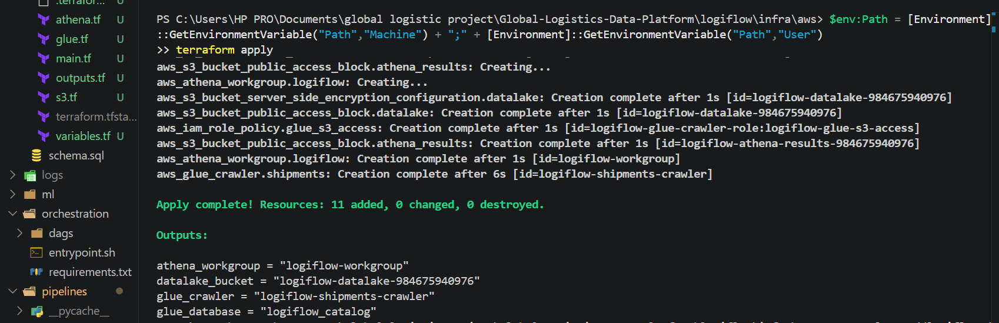
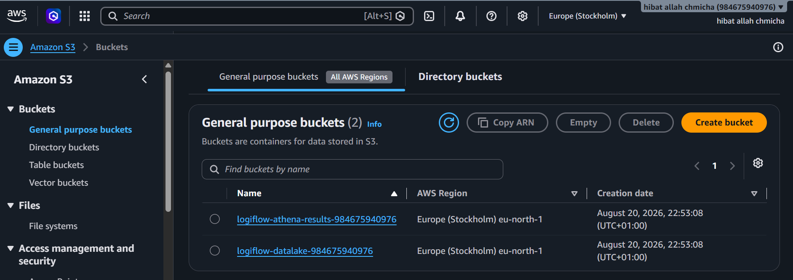
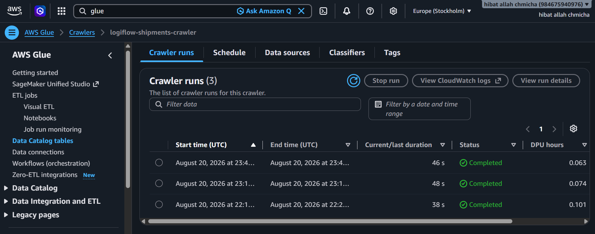
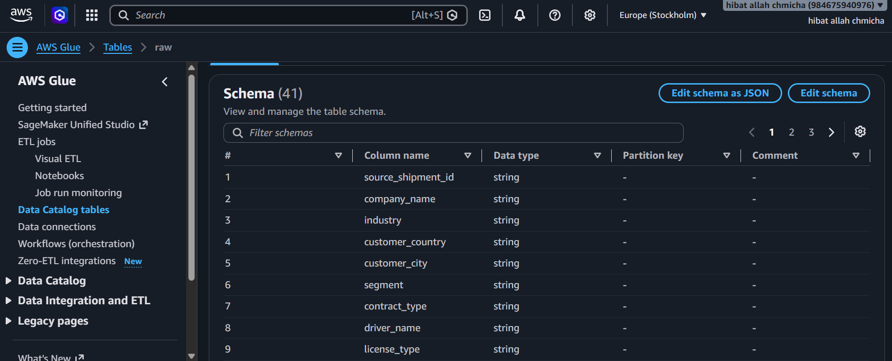
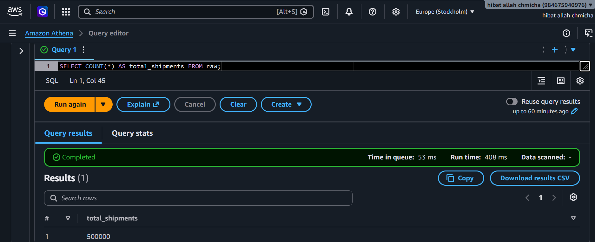
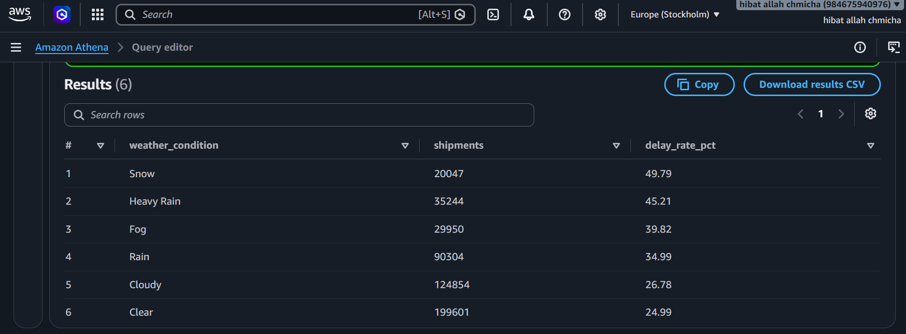
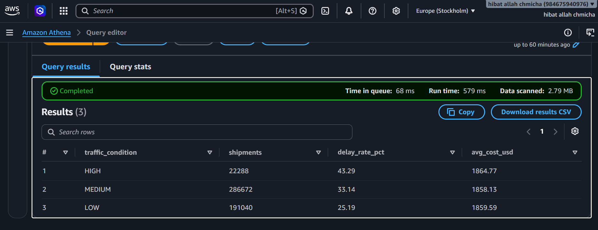

# LogiFlow - End-to-End Logistics Data Platform

> A logistics analytics platform covering the full data lifecycle: synthetic generation with
> live API enrichment, idempotent ELT into a Postgres star schema, an ML delay classifier,
> a REST API and dashboard, daily Airflow orchestration, a Kafka/Spark streaming path, and
> an AWS data lake (S3 + Glue + Athena) provisioned with Terraform.

**Author:** Hibatallah Chmicha · Data Science Student @ INSEA
**Stack:** Python · PostgreSQL · Apache Airflow · Apache Kafka · Apache Spark · Terraform · AWS (S3/Glue/Athena) · FastAPI · Streamlit · Scikit-learn · XGBoost · Docker

---

## Project Overview

LogiFlow simulates a production logistics intelligence system end to end. Shipments are
generated with realistically correlated risk factors and enriched from two live APIs, landed
in object storage, loaded idempotently into a star-schema warehouse, validated by an
automated quality suite, used to train a delay classifier, and served through both a REST
API and a dashboard — with a daily Airflow DAG tying it together and an independent
real-time streaming path alongside it.

The repository was rebuilt from an earlier chronological (`mvp1`–`mvp4`) layout into one
organised by architectural role: a shared library, pipeline scripts, an ML package,
deployable services, orchestration, and streaming. Every module was verified individually
before being wired together — the numbers in this README are measured, not estimated.

**What this demonstrates:**
- **Data engineering** — idempotent ELT, star-schema modelling, object-storage staging behind a swappable abstraction
- **Cloud & IaC** — an AWS data lake defined entirely in Terraform, provisioned and torn down reproducibly
- **Analytics engineering** — REST API, dashboard, and an 8-check automated data quality suite
- **Machine learning** — an enforced train/serve feature contract, 4-model comparison, cross-validated evaluation
- **Orchestration** — an Airflow DAG that calls independently tested modules rather than embedding logic in operators
- **Streaming** — Kafka → Spark Structured Streaming with a genuinely idempotent upsert sink

---

## Architecture

```
LOCAL / CONTAINERISED                          AWS (Terraform-provisioned)
─────────────────────                          ───────────────────────────

pipelines/generate_shipments.py
  ├─ fixed customer/driver/vehicle/route roster
  ├─ live weather (OpenWeatherMap) + traffic (TomTom),
  │  cached per city; simulated for historical backfill
  └─ writes via common/storage.py ──────┬──────────────┐
                                        │              │
                              MinIO (local dev)   S3 data lake
                                        │         (Parquet)
                                        ▼              │
                              pipelines/etl.py         ▼
                              (idempotent upsert)  Glue Crawler
                                        │              │
                                        ▼              ▼
                          PostgreSQL star schema   Glue Data Catalog
                                        │              │
              ┌─────────────────────────┤              ▼
              │                         │           Athena
              ▼                         ▼         (SQL on S3)
   pipelines/quality_checks.py    ml/train.py
        (8 checks)                     │
                                       ▼
                                ml/predict.py
                          (enforced feature contract)
                                       │
                        ┌──────────────┴──────────────┐
                        ▼                             ▼
              services/api (FastAPI)      services/dashboard (Streamlit)

ORCHESTRATION   orchestration/dags/logiflow_pipeline.py  (Airflow, daily 02:00 UTC)
                generate_shipments >> run_etl >> quality_check >> retrain_model

STREAMING       streaming/kafka_producer.py → Kafka → streaming/spark_streaming.py
                → realtime_shipments  (idempotent ON CONFLICT upsert sink)
```

---

## Repository Structure

```
Global-Logistics-Data-Platform/
├── README.md
├── .github/workflows/ci.yml          # 4-job CI pipeline
├── ruff.toml
└── logiflow/
    ├── docker-compose.yml             # postgres, minio, airflow, api, dashboard
    ├── docker-compose.streaming.yml   # kafka, spark, producer, spark-streaming
    ├── pytest.ini
    ├── .env.example
    │
    ├── common/                # shared library -- everything imports from here
    │   ├── config.py          # single source of truth for env vars, fail-fast
    │   └── storage.py         # MinIO/S3 backends behind one interface
    │
    ├── infra/
    │   ├── schema.sql         # star schema DDL, single source of truth
    │   └── aws/               # Terraform: S3 + Glue + Athena + IAM
    │
    ├── pipelines/             # scripts that run, do a job, and exit
    │   ├── generate_shipments.py
    │   ├── etl.py
    │   └── quality_checks.py
    │
    ├── ml/
    │   ├── train.py           # 4-model comparison, retrain safety gate
    │   └── predict.py         # enforced train/serve feature contract
    │
    ├── services/              # long-running, containerised, has a port
    │   ├── api/               # FastAPI, 10 endpoints
    │   └── dashboard/         # Streamlit
    │
    ├── orchestration/         # Airflow DAG + pinned deps + entrypoint
    ├── streaming/             # Kafka producer + Spark job
    ├── tests/
    └── docs/
        ├── architecture.md    # what the system is
        ├── data-model.md      # schema reference
        ├── decisions.md       # why it is built this way
        ├── setup-guide.md     # deployment walkthrough
        └── screenshots/
```

---

## Quick Start

```bash
cd logiflow
cp .env.example .env
# fill in POSTGRES_*, MINIO_ROOT_*, AIRFLOW_*
# OPENWEATHER_API_KEY and TOMTOM_API_KEY are optional -- falls back to simulated data

docker compose up -d --build
```

Postgres applies `infra/schema.sql` automatically on first init. Bootstrap data:

```bash
python -m pipelines.generate_shipments --n 1000000 --days-back 730
python -m pipelines.etl
python -m pipelines.quality_checks
python -m ml.train
```

Or trigger `logiflow_daily_pipeline` in the Airflow UI, which runs the same four steps.

Add the streaming layer:
```bash
docker compose -f docker-compose.yml -f docker-compose.streaming.yml up -d --build
```

| Service | URL |
|---|---|
| Airflow | http://localhost:8080 |
| FastAPI Swagger | http://localhost:8000/docs |
| Streamlit dashboard | http://localhost:8501 |
| MinIO console | http://localhost:9001 |
| Spark master | http://localhost:8082 |

---

## AWS Data Lake

The cloud layer is defined entirely in Terraform (`logiflow/infra/aws/`) — 11 resources
across S3, Glue, Athena, and IAM. It was provisioned, verified end to end, and then torn
down; the screenshots below are the record of that run.

```bash
cd logiflow/infra/aws
terraform init
terraform plan      # dry run -- creates nothing
terraform apply     # 11 resources
```

Switching the pipeline from local MinIO to S3 required **no changes to any pipeline code** —
only two environment variables, because every caller goes through `common/storage.py`:

```
STORAGE_BACKEND=s3
BUCKET_NAME=logiflow-datalake-<account-id>
```

**Provisioned infrastructure**



**S3 buckets — data lake + Athena results, both eu-north-1**



**Glue crawler runs — schema inferred from S3, no DDL written by hand**



**Glue Data Catalog — 41 columns and types inferred automatically**



**500,000 rows queryable from S3.** `Data scanned: -` — a `COUNT(*)` on Parquet reads
footer metadata and touches no row data at all.



**Delay rate by weather condition** — this independently validates the whole chain. The
generator encodes risk weights `Snow 0.25 > Heavy Rain 0.20 > Fog 0.15 > Rain 0.10 >
Cloudy 0.02 > Clear 0`, and Athena returns exactly that ordering. The row distribution
also matches the configured `WEATHER_WEIGHTS` to within 0.1 percentage points — the
statistical design survived generation → Parquet → S3 → Glue → SQL intact.

```sql
SELECT weather_condition,
       COUNT(*) AS shipments,
       ROUND(AVG(CASE WHEN is_delayed THEN 1.0 ELSE 0.0 END) * 100, 2) AS delay_rate_pct
FROM raw
GROUP BY weather_condition
ORDER BY delay_rate_pct DESC;
```



**Delay rate by traffic congestion — and the columnar payoff.** This query touches 3 of
41 columns and scans **2.79 MB**; the same data as CSV would be ~170 MB. Note that
`avg_cost_usd` is flat across all three levels — that is correct, since cost is generated
independently of traffic.



**Cost:** the entire provision → load → query → destroy cycle cost under $1. Analytical
queries ran at roughly $0.0002 each. Orchestration and streaming were deliberately kept
local rather than moved to MWAA (~$350/month) and MSK (~$150/month), which would have
added recurring cost without adding anything to learn.

---

## Key Results

All measured during real runs, not estimated.

| Metric | Value | How it was verified |
|---|---|---|
| Warehouse volume | 1,001,000 shipments | `COUNT(*)` on `fact_shipments` after a full ETL run |
| Data lake volume | 500,000 rows (Parquet) | Athena `COUNT(*)` |
| ETL idempotency | Confirmed | Ran the loader twice on identical input — row count unchanged |
| Best model | 0.645 ROC-AUC (Gradient Boosting) | 800,800 train / 200,200 test; CV 0.646 agrees within 0.001 |
| Models compared | 4 | Logistic Regression, Random Forest, Gradient Boosting, XGBoost |
| Data quality | 8 checks, critical/non-critical split | Wired into the DAG's failure logic |
| Airflow DAG | 4 tasks, all green | Real triggered run, generate → ETL → quality → retrain |
| Streaming | 2,185 events ingested | Kafka → Spark → Postgres, verified end to end |
| Athena scan efficiency | 2.79 MB/query | vs ~170 MB for the CSV equivalent |
| Cloud infrastructure | 11 resources | `terraform apply`, then destroyed |
| CI | 4 jobs passing | Lint, compose validation, import checks, unit tests |

---

## Why the ROC-AUC is 0.645

Worth stating plainly rather than burying. All four models converged to roughly the same
ceiling (0.62–0.65) regardless of complexity, and that convergence is itself the finding:
the limit isn't model choice, it's the label. `generate_shipments.py` computes a delay
*probability* from weather/traffic/driver/vehicle factors and then draws a random outcome
from it. Even a perfect classifier that recovered the true probability exactly would be
capped well below 1.0 ROC-AUC by construction. The CV–test agreement (0.646 vs 0.645)
confirms the number is stable rather than a lucky split.

---

## Design Decisions Worth Defending

Full reasoning in [docs/decisions.md](logiflow/docs/decisions.md). The short version:

- **Why upsert instead of truncate-and-reload?** The original design truncated the entire
  warehouse before every load, so only the most recent ~100 rows ever survived a day. A
  UUID `source_shipment_id` assigned at generation time, plus natural-key uniqueness on
  every dimension, makes every load idempotent — verified by running the loader twice and
  confirming the row count didn't move.

- **Why is `common/storage.py` its own file?** It's the only file that changed when the
  project migrated from MinIO to S3. Every pipeline calls `storage.upload_bytes()`; none
  of them touch a storage SDK. The migration proved this rather than assuming it.

- **Why real APIs for recent data but simulated for history?** OpenWeatherMap and TomTom
  answer "what is happening now." Calling them for a shipment backdated 18 months would
  stamp today's conditions on a year-old record — wrong data dressed as real. Caching
  doesn't fix that, because the API cannot answer for the past at all.

- **What happens if a Kafka event arrives twice?** The producer uses `acks="all"` — that's
  at-least-once delivery, so duplicates are expected, not hypothetical. The Spark sink
  performs a real `INSERT ... ON CONFLICT (event_id) DO NOTHING` per partition rather than
  a plain JDBC append, which would fail on the first duplicate.

- **What's decorative rather than load-bearing?** Nothing downstream currently reads
  `realtime_shipments` — the streaming layer is an independently working demonstration,
  not yet integrated into the analytics layer. Stated up front rather than left to be
  discovered.

---

## Known Gaps

Not hidden, not yet built:

- No drift detection. `ml/train.py` warns loudly when a retrain scores worse than the
  model it replaces and keeps one rollback copy, but nothing blocks the swap.
- No alerting on pipeline failure (`email_on_failure: False`) — visible only in the Airflow UI.
- Model artifacts aren't versioned beyond that single rollback copy.
- `dim_vehicle.last_service_date` and `is_active` are declared in the schema but never
  populated by the loader.
- The streaming layer isn't consumed by the API or dashboard.

---

## Documentation

| Document | Contents |
|---|---|
| [docs/architecture.md](logiflow/docs/architecture.md) | Component inventory, data flows, infrastructure notes |
| [docs/data-model.md](logiflow/docs/data-model.md) | Full schema reference and the reasoning behind it |
| [docs/decisions.md](logiflow/docs/decisions.md) | Every design decision that had a real alternative |
| [docs/setup-guide.md](logiflow/docs/setup-guide.md) | Step-by-step deployment and troubleshooting |

---

## Contact

**Hibatallah Chmicha**
Data Science Student @ INSEA
[GitHub](https://github.com/hibatallahchmicha) · [LinkedIn](https://linkedin.com/in/hibatallahchmicha)
