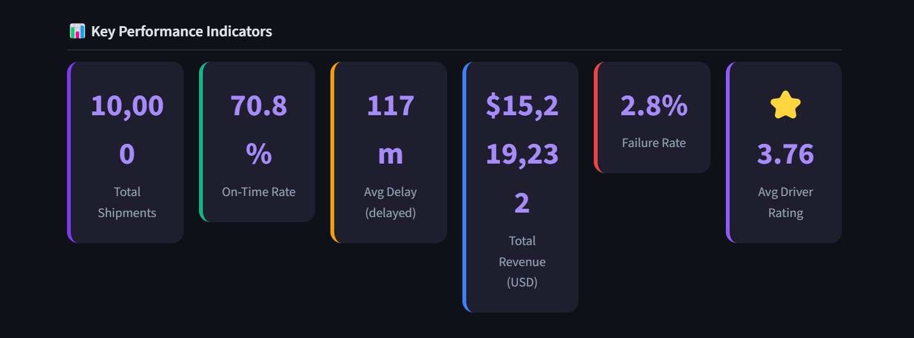
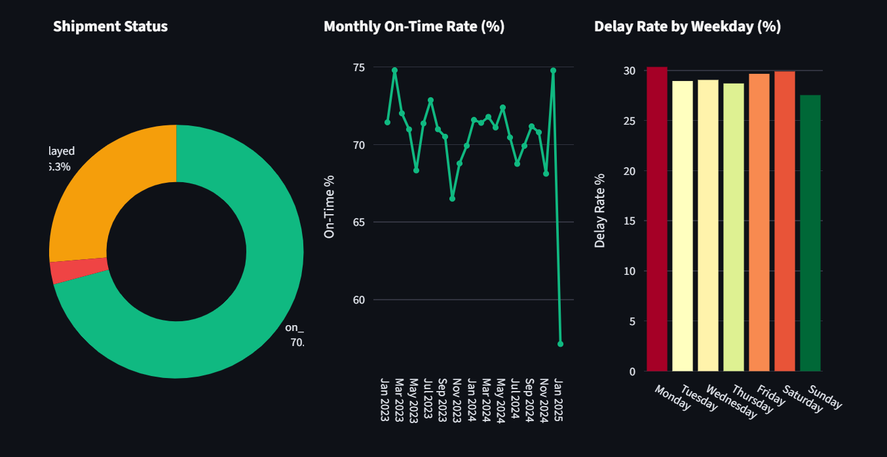
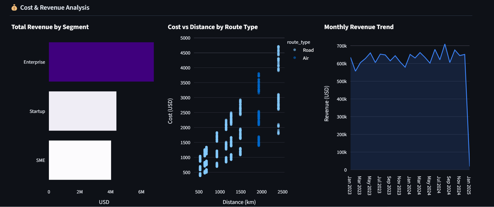
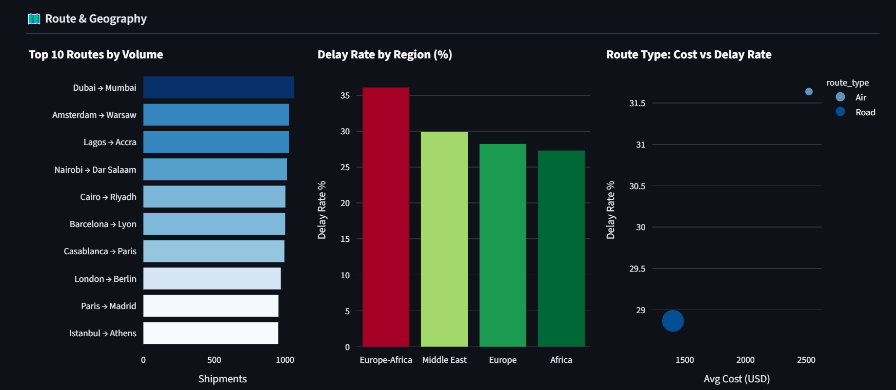
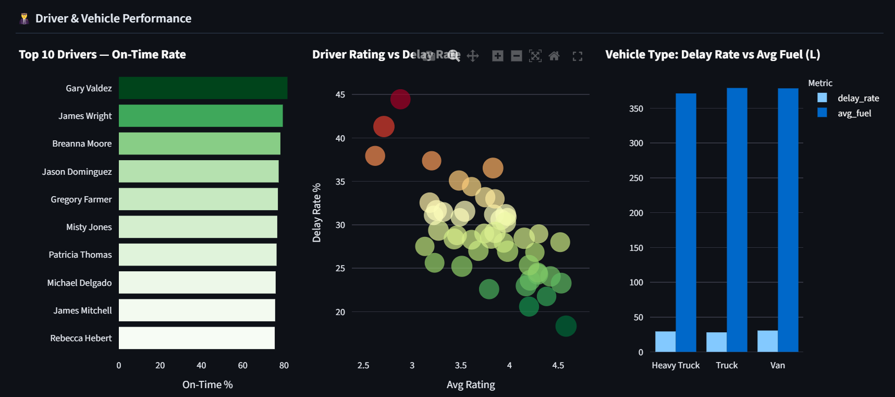
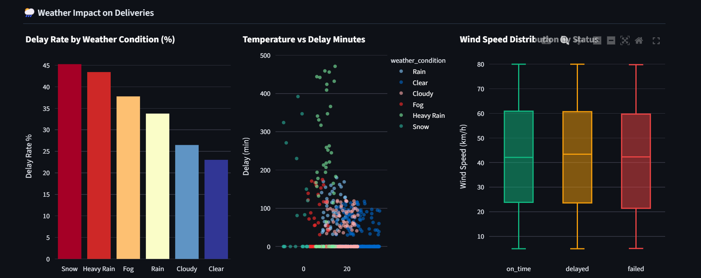
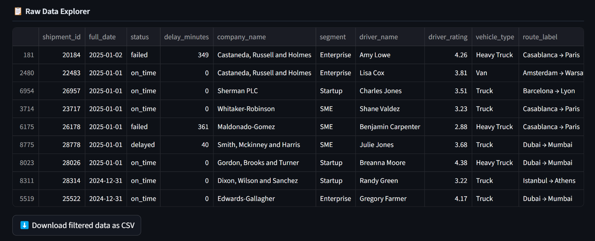

# 📊 MVP 2A — Analytics Dashboard

Interactive logistics analytics dashboard built with Streamlit + Plotly,
connected directly to the PostgreSQL data warehouse.

## 🚀 How to Run

```bash
# From project root
cd mvp2-analytics-layer/2A-dashboard
pip install -r requirements.txt
streamlit run app.py
```

Open http://localhost:8501

## 📸 Dashboard Preview

### KPI Cards


### Delivery Performance


### Cost & Revenue Analysis


### Route & Geography


### Driver & Vehicle Performance


### Weather Impact


### Data Explorer


## 📋 Features

- **6 KPI cards** — total shipments, on-time rate, avg delay, revenue, failure rate, driver rating
- **Delivery performance** — status breakdown, monthly trend, weekday analysis
- **Cost & revenue** — by segment, cost vs distance, monthly trend
- **Route & geography** — top routes, delay by region, route type comparison
- **Driver & vehicle** — top performers, rating vs delay correlation
- **Weather impact** — delay by condition, temperature & wind analysis
- **Data explorer** — filterable table with CSV download

## 🔧 Tech Stack

- **Streamlit** — dashboard framework
- **Plotly** — interactive charts
- **SQLAlchemy + psycopg2** — PostgreSQL connection
- **Pandas** — data manipulation