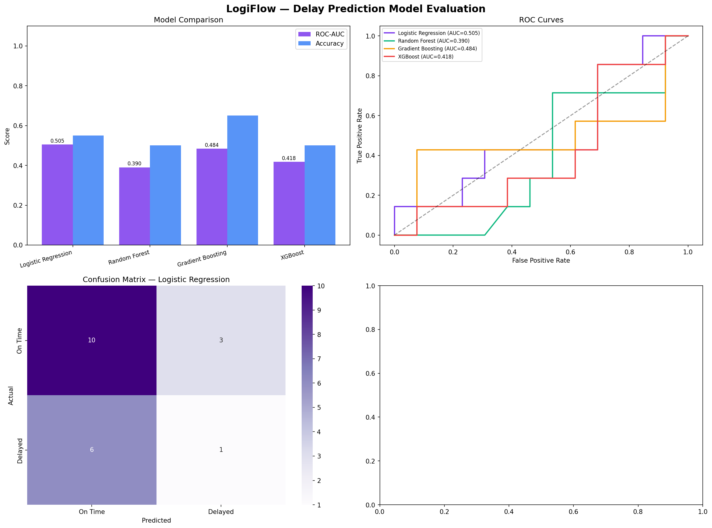
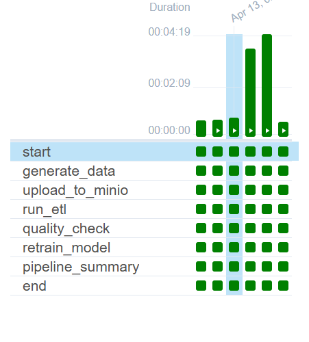

# MVP 3 - Advanced Intelligence and Orchestration

MVP 3 upgrades LogiFlow from a batch analytics platform into an intelligent, production-style system by combining:

- ML delay prediction
- Real weather-enriched shipment generation
- Airflow orchestration of end-to-end pipeline tasks

## Modules

### 3A - ML Prediction
Path: `3A-ml-prediction/`

What is included:
- Model training pipeline (`train.py`)
- Inference script (`predict.py`)
- Model artifact output (`models/delay_predictor.pkl`)
- Evaluation reports and plots (`reports/`)

Current evidence (generated in your workspace):



### 3B - Real Data Integration
Path: `3B-real-data/`

What is included:
- Real weather integration via OpenWeather API
- Realistic shipment generation with weather effects
- CSV output consumed by ETL/Airflow

### 3C - Airflow Orchestration
Path: `3C-airflow-orchestration/`

What is included:
- DAG orchestration for full daily pipeline
- Task sequence:
  1. `generate_data`
  2. `upload_to_minio`
  3. `run_etl`
  4. `quality_check`
  5. `retrain_model`
  6. `pipeline_summary`
- Successful run state confirmed in Airflow UI (all tasks green)

## Airflow Success Screenshot

Save your Airflow success image in this folder:
- `assets/screenshots/airflow_pipeline_success.png`

Then this README will automatically display it:



## MVP 3 Completion Checklist

- [x] Real data generation with weather enrichment
- [x] ETL integration with warehouse
- [x] Quality checks passing
- [x] Model retraining task fixed and operational
- [x] Airflow DAG end-to-end orchestration active
- [ ] Airflow success screenshot committed in repo path above

## How to Run MVP 3

From `logiflow/`:

```bash
docker compose up -d
```

Trigger DAG manually:

```bash
docker exec logiflow_airflow airflow dags trigger logiflow_daily_pipeline
```

Check task states in Airflow UI:
- URL: `http://localhost:8080`
- DAG: `logiflow_daily_pipeline`

## MVP 4 Next Step (Streaming)

Now that MVP 3 is green, move to real-time streaming in a separate stack.

Start core services first:

```bash
cd logiflow
docker compose up -d
```

Start streaming services (Kafka + Spark + producer + consumer):

```bash
docker compose -f docker-compose.yml -f docker-compose.streaming.yml up -d --build
```

Quick validation checklist:
- Kafka UI opens on http://localhost:8090
- Spark Master UI opens on http://localhost:8082
- Table `realtime_shipments` receives new rows in PostgreSQL

Example check:

```bash
docker exec logiflow_postgres psql -U logiflow_user -d logiflow -c "SELECT COUNT(*) FROM realtime_shipments;"
```
