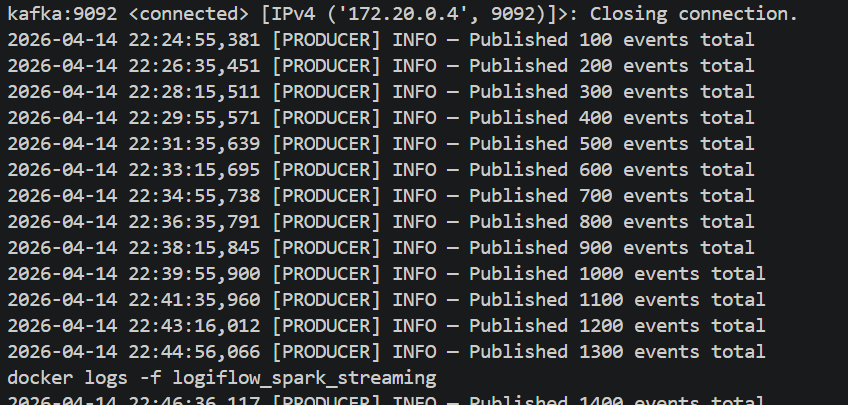
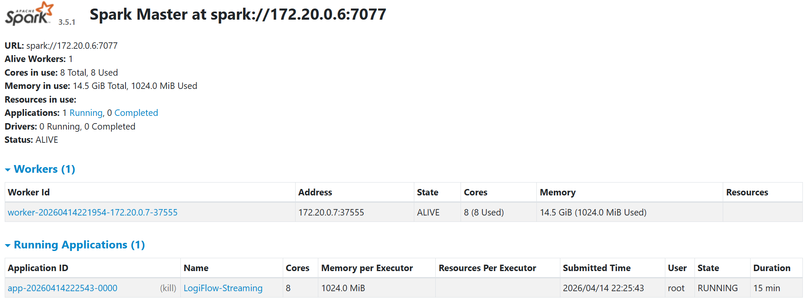
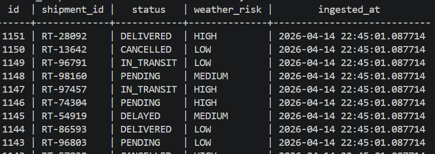

# MVP 4 - Real-Time Streaming

MVP 4 extends LogiFlow from batch orchestration into real-time event processing.
The pipeline now streams shipment events continuously through Kafka, processes them with Spark Structured Streaming, and lands enriched records in PostgreSQL.

## Architecture

Flow:

Producer -> Kafka -> Spark Streaming -> PostgreSQL

Main components:
- shipment producer generates live shipment events
- Kafka stores the event stream in the shipment_events topic
- Spark consumes the topic and enriches each event
- PostgreSQL stores the final records in the realtime_shipments table

## What proves MVP 4 is working

To keep the README clean and professional, only these three screenshots are needed:

### 1. Kafka topic activity
This is the most important Kafka screenshot because it shows the shipment_events topic and the growing message count.

### 2. Spark streaming application running
This proves the worker is connected and the LogiFlow-Streaming job is actively running.

### 3. Real-time rows in PostgreSQL
This is the final proof of end-to-end success because it shows the processed shipment events written into the realtime_shipments table.

## Screenshots intentionally excluded

The following were left out because they are redundant or less informative:
- duplicate producer log screenshots
- generic Kafka dashboard overview
- Kafka broker details page

Those views are useful during debugging, but they are not necessary in the final README.

## Success Criteria

MVP 4 is considered complete when:
- Kafka is receiving shipment events
- Spark is actively processing the stream
- PostgreSQL is storing live enriched rows

Current evidence already confirms this flow is operational.
